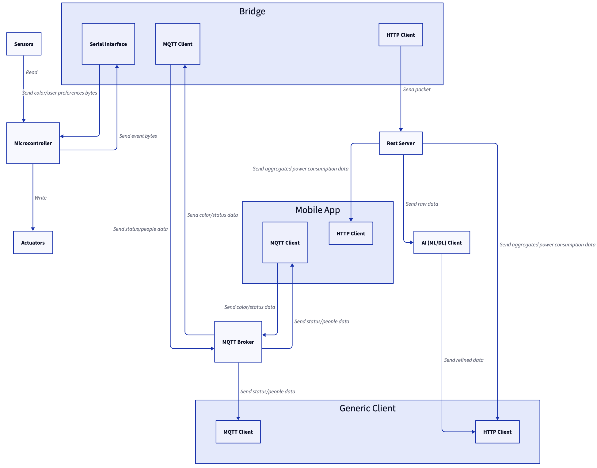

# STYLEGUIDE

## STYLE 

- How many times do we forget a light on? 
  - When you're in a hurry in the morning because you're late and you must go to work, for instance. In that case, the light could stay on until you get home in the evening, leading to a waste of energy (but most importantly, a waste of money)!
- How many times are we too lazy to turn it off?
  - You're home after a very tough day, you lay on the couch ready to watch a movie, and then realize...the light is on! Who cares, you can turn it off when you're going to bed right? 
- What if the lights could understand on their own what to do? 

**Stop Telling Your Lights Everything**: a true smart light should be able to autonomously detect whether it has to turn on, off, dim itself, or which color to pick for a certain scenario. 

STYLEGUIDE provides a light that is able to learn how to suit the user's needs over time, making each one of them unique like the person they serve. Its goal is to minimize the manual intervention of the user, drastically reducing the time requested for configuration. 

Current solutions often require purchase and (complex) manual configuration of different times, lacking a native support to make one's life easier. 

In turn, our solution offers an all-in-one system, with a mainly automatic (dynamic) configuration and an out-of-the-box support for tuning properly the light setting without driving you crazy.

## GUIDE 

- Outdoor lighting uses 120 terawatt-hours of energy in an average year in the U.S.
	- Enough energy to meet New York City's total electricity needs for two years 
- least 30 percent of all the outdoor lighting in the U.S. is wasted 
	- That adds up to $3.3 billion and the release of 21 million tons of carbon dioxide per year 
	- To offset all that carbon dioxide, we'd have to plant 875 million trees annually 
	- Source: [Light pollution wastes energy and money and damages the climate | DarkSky International](https://darksky.org/resources/what-is-light-pollution/effects/energy-climate/) 
- Unnecessary indoor lighting (ex. empty office buildings at night)

**Green Up Ideal Daily Environment**: STYLEGUIDE is great not only for you (and your wallet), but also for the planet, having as target audience homeowners, businesses, smart cities and many more, leading to a win-win scenario.

## User-centered desigm 

Of course, in order for the light to become your buddy it needs to know you better and this requires time. Moreover, sometimes it's difficult to satisfy some needs if not explicitly told how to. 

And that's why, even though STYLEGUIDE does its best to avoid the user having to setting things manually, they still have the total control over what's going on through the **companion app**, which they can use to specify preferences, custom routines and much more.

## Architecture 

The system design is the following: 

Every component detail is explained in its own repo. 

> [!NOTE] For the real prototype, just one microcontroller connected to both sensors and actuator has been used.